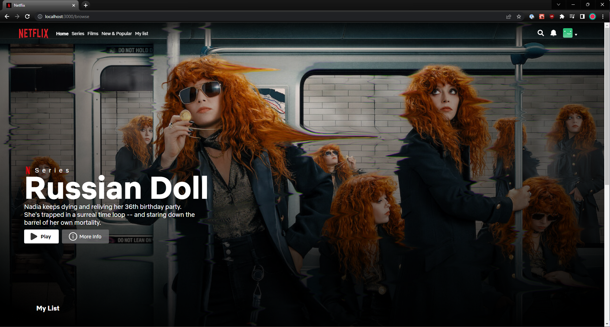
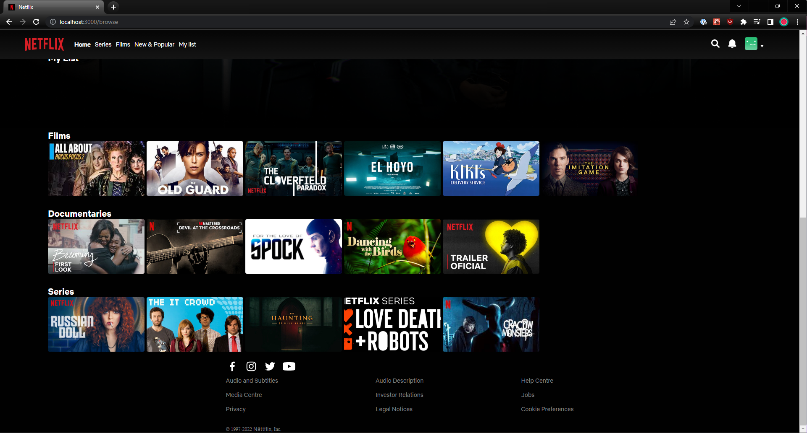
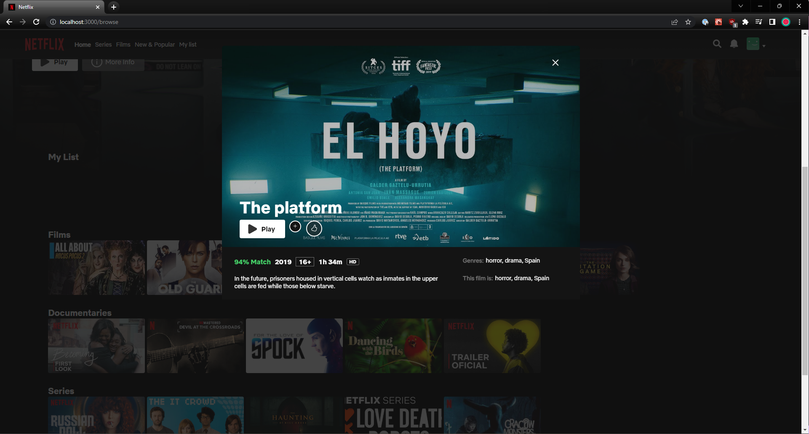
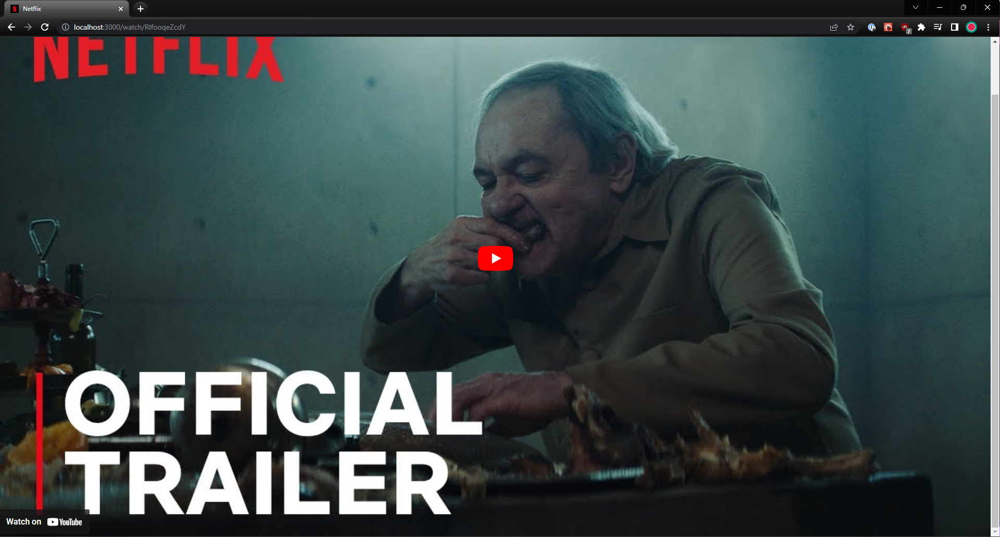
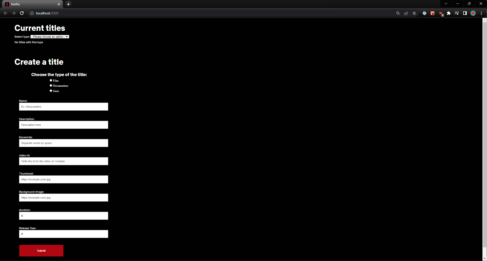
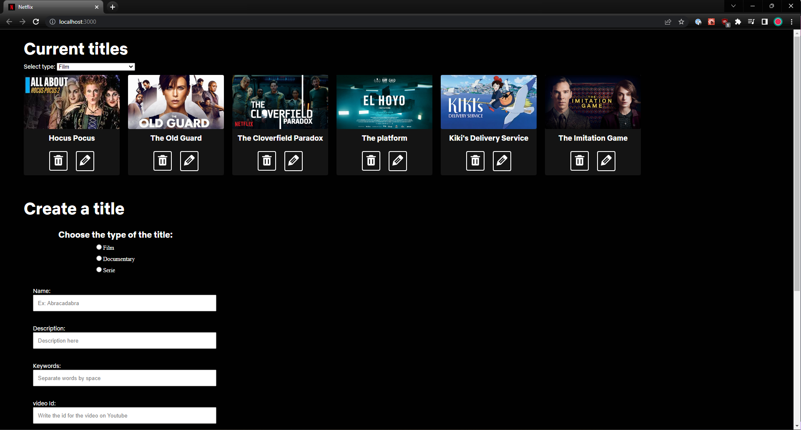
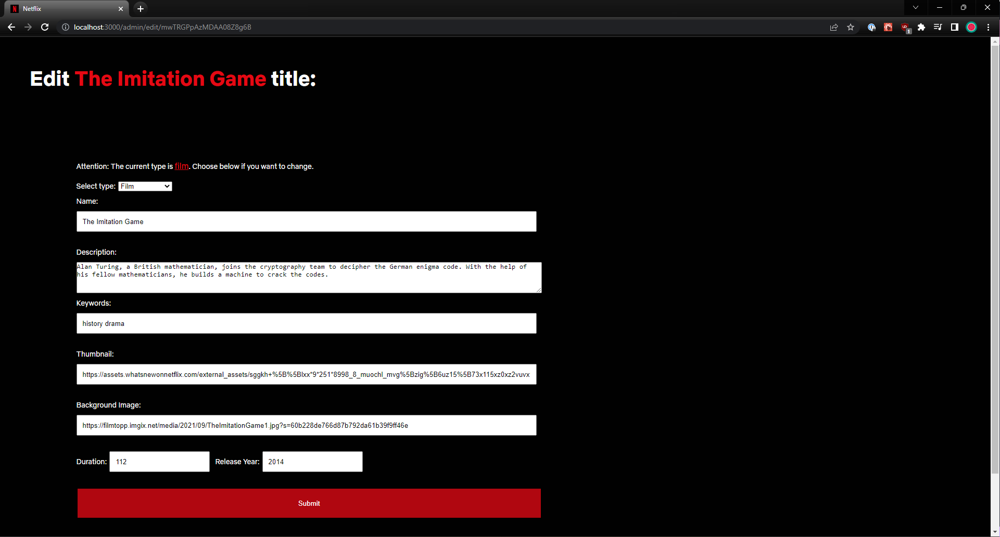
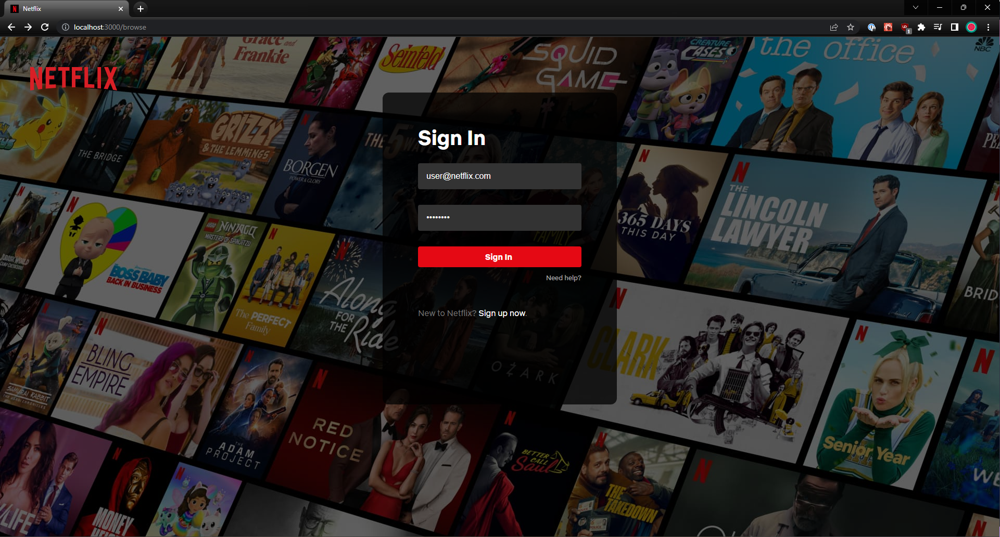
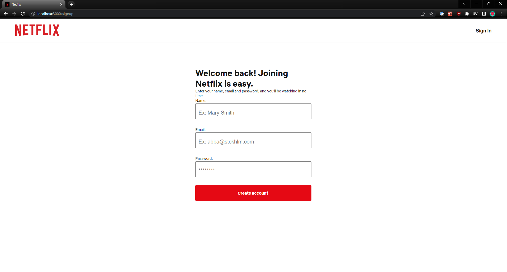
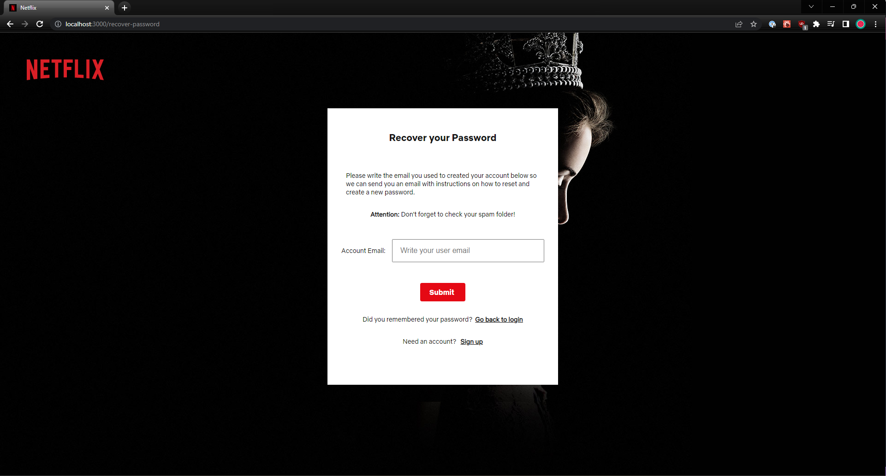

# Welcome to Nättflix, a Netflix clone

This is Nättflix website, where you can sign up to watch series and movies to ~~fall asleep to~~ enjoy!

The **data is created dynamically** through an admin page connected to the Firestore Database. If you want to test it, ask me for the admin account. Prints of the functionalities are below!

It is a desktop first page following the netflix web format, so please open it on a desktop browser.

You can visit the page [here](https://netflix-clone-project-825bf.web.app/) to see the working website.

## Scroll down to see all the app prints! :)

## Tech stack

1. React
2. CSS
3. JSON
4. Firebase
5. Firestore
6. Firebase Authentication
7. Firebase Cloud Storage

### Assets

1. Fonts from Google Fonts
2. Images from Unsplash

## If you want, you can run the project locally

In development mode:

1. Clone or download the repository in your computer.

2. Type `npm install` to install the project dependencies.

3. start the application with `npm start`, it will open a `localhost:3000` page automatically in your default browser.

## Prints

### Main website - User

### Admin page

### Logged off

